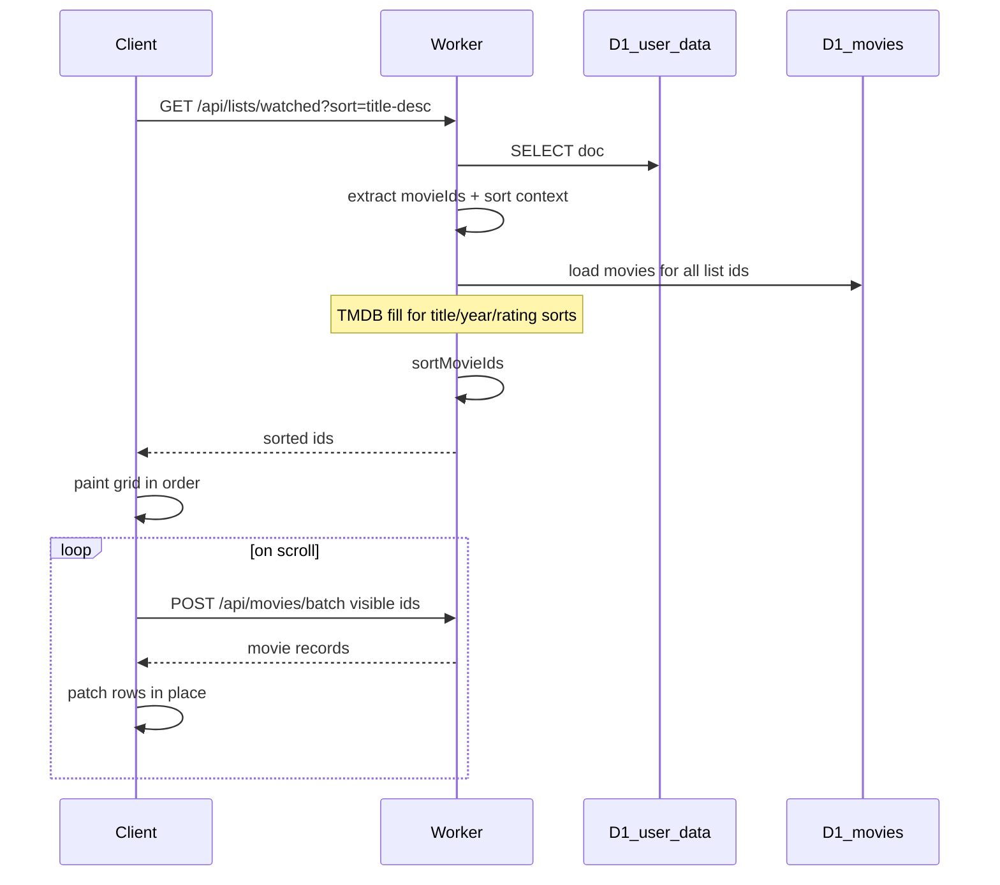

# Server-sorted list IDs

## Problem

Sortable lists (Watched, custom list detail) sort on the client via [`displayMovieIds()`](js/app/01-config-dom-state.js) and [`sortMovieIds()`](scripts/lib/sort.js). Title/year/fan-rating sorts need TMDB metadata that arrives lazily, which caused cards to load and then jump. The current workaround in [`js/app/05-render.js`](js/app/05-render.js) (skeleton → fetch → reorder → reveal) is brittle.

## Approach

Split two jobs:

1. **Sort order** — Worker reads the user doc, loads movie metadata from D1 (TMDB fill for metadata sorts), sorts the full id list, returns `{ listId, sort, ids }`.
2. **Lazy display** — Client paints the grid in that order, then uses existing viewport hydration ([`IntersectionObserver`](js/app/05-render.js) + [`POST /api/movies/batch`](worker/src/movies-cache.js)) to fill posters and detail as the user scrolls.

No pagination. No client-side reorder. Watchlist stays stored order only ([`scripts/lib/lists.js`](scripts/lib/lists.js)).



## API

```
GET /api/lists/watched?sort=title-desc
GET /api/lists/watchlist
GET /api/lists/custom/{customId}?sort=year-desc
```

| Param | Notes |
|-------|-------|
| `sort` | Valid [`SORT_MODES`](scripts/lib/sort.js) value; ignored for watchlist |

```json
{
  "listId": "watched",
  "sort": "title-desc",
  "ids": [550, 603, 27205]
}
```

- Auth: session bearer (same as [`GET /api/data`](worker/src/index.js))
- Rate limit: ~60/user/15min
- Keep [`POST /api/movies/batch`](worker/src/movies-cache.js) for hydration, detail, search, discover

## Design decisions

| Topic | Choice |
|-------|--------|
| Response | Full sorted `ids` array (typically a few KB) |
| Movie records | Not in list response; lazy-loaded via batch API |
| Sort execution | In-memory on Worker over full list |
| Metadata sorts | TMDB fill for all list ids before sort ([`movies-cache.js`](worker/src/movies-cache.js)) |
| Sort logic | Canonical [`scripts/lib/sort.js`](scripts/lib/sort.js), synced to Worker via `npm run sync-worker-lib` |
| Client rollout | Metadata sorts first; other sorts stay client-side until PR 4 |
| Cold start | First title/year/rating sort on a large uncached list waits on Worker; subsequent visits hit D1 |

## PR 1 — Lib + tests

Add [`scripts/lib/list-query.js`](scripts/lib/list-query.js):

```js
sortedListIds({ userDoc, listId, sort, getMovieRecord }) → { ids, sort }
```

- Resolve list ids from user doc ([`lists.js`](scripts/lib/lists.js), [`custom-lists.js`](scripts/lib/custom-lists.js))
- Build sort context matching [`displayMovieIds()`](js/app/01-config-dom-state.js)
- Call `sortMovieIds()` on the full array

Add [`test/list-query.test.js`](test/list-query.test.js): parity across sort modes, watchlist ignores sort, empty/invalid list, missing metadata tiebreak.

**Exit:** `npm test` green; no production change.

## PR 2 — Worker route

- [`scripts/sync-worker-lib.js`](scripts/sync-worker-lib.js) — copy sort + list-query into [`worker/src/lib/`](worker/src/) as ESM
- [`worker/src/list-routes.js`](worker/src/list-routes.js) — parse path, load user doc, D1 movies, TMDB fill for metadata sorts, return sorted ids
- Wire in [`worker/src/index.js`](worker/src/index.js)
- [`worker/test-list-routes.js`](worker/test-list-routes.js)

**Exit:** Deploy Worker; curl order matches PR 1 fixtures.

## PR 3 — Client

Add `fetchSortedListIds()` in [`js/app/03-tmdb-client.js`](js/app/03-tmdb-client.js).

| Sort field | Order source |
|------------|--------------|
| title, year, rating | Server |
| user-rating, added, watched, custom | Client (unchanged) |
| Watchlist | Stored order (unchanged) |

In [`js/app/05-render.js`](js/app/05-render.js): await server ids → `paintMovieGrid(ids)` → viewport IO. Fallback to client sort on API error. Remove `renderMetadataSortedGrid()`.

**Exit:** No DOM reorder on metadata sorts; My Rating path unchanged.

## PR 4 — Optional

- Move user-rating/added/watched sorts to server
- `GET /api/friends/{id}/lists/...` for friend view

## Success criteria

- Title/year/fan-rating on large lists: zero reorder while scrolling
- Viewport lazy-load unchanged
- Watchlist drag-reorder unchanged
- Tests green; client fallback on API failure

## Start here

PR 1 only — proves server sort matches client before Worker or UI work.
