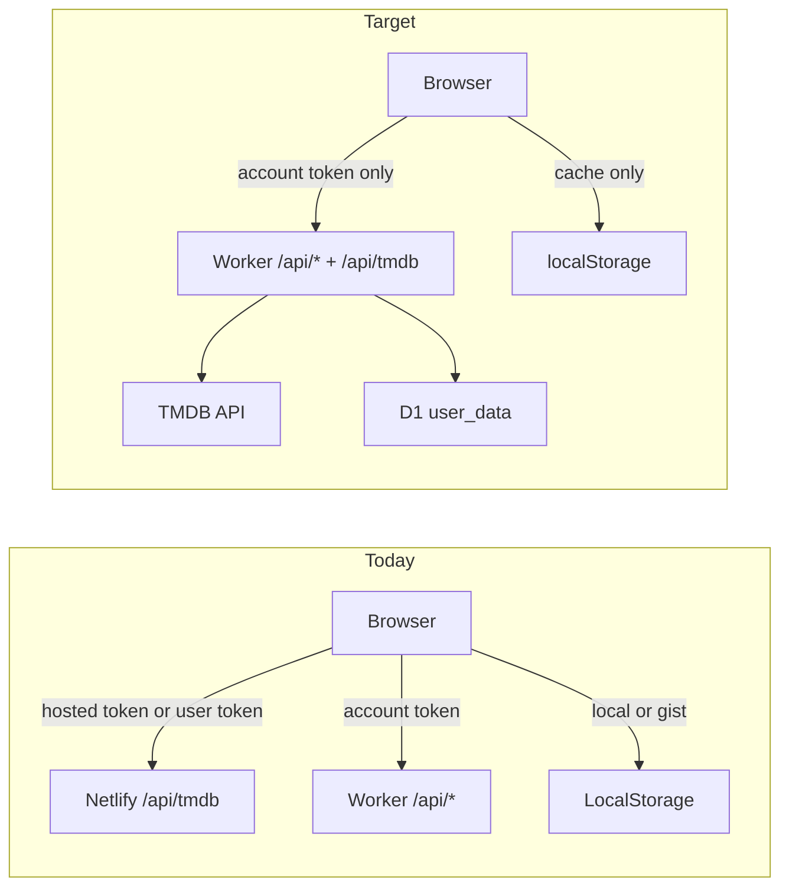

# Account-only storage + account-gated TMDB proxy

## Goal

Single identity and single cloud store:

- **Lists:** Cloudflare account sync only (no "This device" / GitHub Gist modes).
- **TMDB:** Server `TMDB_READ_TOKEN` on the Worker; users never paste a token or use triple-click hosted unlock.
- **Auth:** One bearer token (`moviecollector-account`) gates account API **and** TMDB proxy.
- **Localhost:** Same rules as production (per your choice).
- **Migration:** No auto-merge on login/signup—users export CSV before cutover if they care about existing local/Gist data.

## Current vs target



| Concern            | Today                                                    | Target                                                  |
| ------------------ | -------------------------------------------------------- | ------------------------------------------------------- |
| List storage modes | `local` / `gist` / `account`                             | **`account` only**                                      |
| TMDB auth          | `HOSTED_SITE_PASSWORD` unlock **or** Settings token      | **Account session** on Worker                           |
| TMDB proxy host    | `netlify/functions/tmdb.js`                              | **Worker** (Netlify redirects `/api/tmdb` → Worker)     |
| `hasTmdbAccess()`  | hosted session **or** personal token                     | **`accountSyncEnabled()`**                              |
| Login/signup merge | `connectAccount` pushes local → cloud                    | **Pull remote only**; no push of local lists on connect |

**Out of scope for this plan** (see [`replace-scrape-with-tmdb-cache.md`](replace-scrape-with-tmdb-cache.md)): D1 movie metadata cache, removing `data/movies.json` from deploy. Snapshot can stay temporarily so ids in `data/` still hydrate without TMDB until that plan lands.

---

## Phase 1 — Worker TMDB proxy (account-gated)

### 1.1 Add `GET /api/tmdb` on Worker

In `worker/src/index.js`:

- **Before** TMDB fetch: `requireUser(request, env)` — same as `/api/data`.
- Parse query using the same allowlist as `scripts/lib/tmdb-proxy.js` (`path`, allowed query keys, path patterns). Port logic into `worker/src/tmdb-proxy.js` — do not widen the allowlist.
- Upstream fetch with `env.TMDB_READ_TOKEN` in `Authorization: Bearer` header, 12s timeout.
- Return upstream status/body JSON; set `Cache-Control` optionally for safe GETs (e.g. `/configuration`).

### 1.2 Secrets and config

- Add **`TMDB_READ_TOKEN`** to Worker secrets (`wrangler secret put TMDB_READ_TOKEN`).
- Document in `README.md` and `worker/wrangler.toml` comments.
- **Move** token off Netlify env once Worker proxy is live (Netlify no longer needs it for TMDB).

### 1.3 Rate limiting

Add lightweight fixed-window limits on `/api/tmdb` (reuse D1 `rate_limits` pattern):

- Per `uid`: e.g. 120 requests / 15 min.
- Per IP fallback for defense in depth.

### 1.4 Tests

- `worker/test-tmdb-proxy.js`: allowlist rejects bad paths; auth required (401 without bearer).

---

## Phase 2 — Netlify routing

Update `netlify.toml`:

```toml
[[redirects]]
  from = "/api/tmdb"
  to = "https://cinequeue-api.cinequeue.workers.dev/api/tmdb"
  status = 200
  force = true
```

- Remove `/api/auth` redirect (hosted unlock retired).
- Keep `/api/backend/*` as today.

Delete `netlify/functions/tmdb.js` and `netlify/functions/auth.js`.

---

## Phase 3 — Frontend: one token for TMDB + account

### 3.1 TMDB client (`js/app/03-tmdb-client.js`)

- **`hasTmdbAccess()`** → `accountSyncEnabled()`.
- **`fetchTmdb`:** always proxy via `/api/tmdb` with **`accountConfig.token`** as Bearer.
- **Localhost:** direct Worker URL via `resolveTmdbApiBase()` in `scripts/lib/account-sync.js`.

### 3.2 Account connect behavior (`js/app/03-user-state.js`)

- **`connectAccount`:** `queueAccountSync({ push: false })` — no push of local lists on signup/login.
- **`disconnectAccount`:** clear account config; keep `storageMode: "account"`.

### 3.3 Login gate

When `!accountSyncEnabled()`:

- Show **“Sign in to use CineQueue”** empty states pointing to Settings → Account.
- Block add-movie search, discover, and sync until logged in.

---

## Phase 4 — Remove local / Gist / hosted UI and modes

- `STORAGE_MODES` → `["account"]` only in `scripts/lib/user-state.js`.
- Remove Gist sync/backup from bundle and `js/app/03-user-state.js`.
- Account-only Settings UI; remove TMDB Settings and hosted unlock dialogs.

---

## Phase 5 — Docs, deploy, cleanup

### Cloudflare (you run)

```bash
cd worker
wrangler secret put TMDB_READ_TOKEN   # same v4 read token used for scrape today
wrangler deploy
```

Ensure `SESSION_SECRET` and `SIGNUP_INVITE_CODE` already set.

### Netlify

- Remove `HOSTED_SITE_PASSWORD` and `TMDB_READ_TOKEN` from site env (after Worker has token).
- Redeploy static site (`npm run build`).

---

## Migration checklist (for you + users)

Before deploying to production:

1. Export lists via **Settings → Import & export → Export** if anything matters in local/Gist-only data.
2. Sign up / log in to account.
3. Import CSV if bringing old lists into the new account (export-only — app will not merge automatically).

---

## Testing checklist

- [ ] `cd worker && npm test`
- [ ] `npm test`
- [ ] Logged out: search/discover blocked; clear messaging
- [ ] Signup with invite code → login → TMDB search works without Settings token
- [ ] `/api/tmdb` returns 401 without account bearer (curl)
- [ ] Production: `/api/tmdb` via Netlify redirect + CORS
- [ ] Localhost:8743 → Worker with account token
- [ ] Account sync, friends, delete account unchanged
- [ ] Logout → login gate; no fallback to local-only mode with full TMDB access
