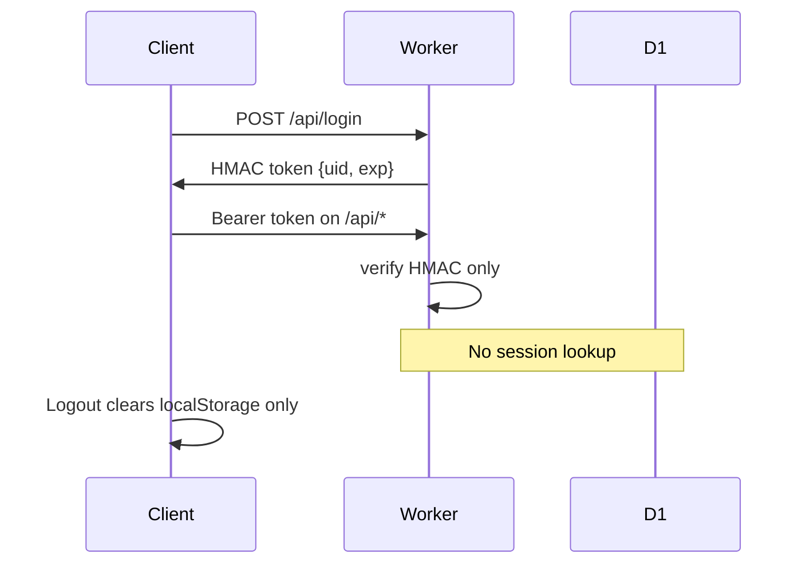
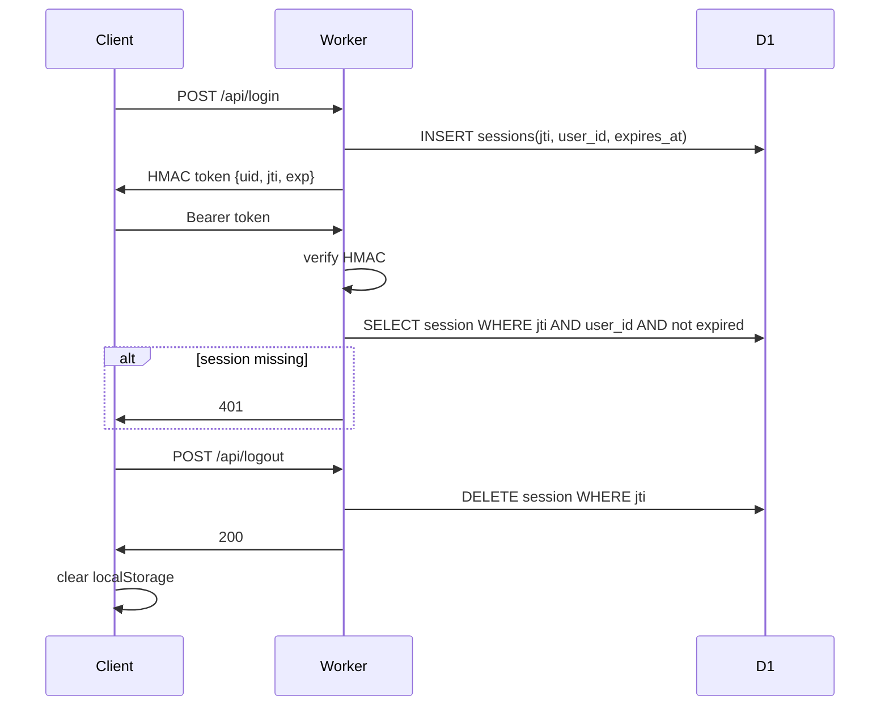

# JTI session revocation plan

Status: implemented.

## Goal

Replace purely stateless user bearer tokens with **stateless crypto + server-side session rows**. Logout deletes one session; account delete removes all sessions for that user. Stolen tokens stop working immediately after revoke.

**Out of scope:** Admin auth ([`worker/src/admin.js`](../worker/src/admin.js)) stays on its existing short-lived stateless tokens unless we decide to unify later.

## Current state



- Token mint/verify: [`worker/src/index.js`](../worker/src/index.js) (`createSessionToken`, `verifySessionToken`, `requireUser`)
- Login/signup issue tokens via `issueToken()` → no DB session row
- Logout: [`js/app/06-dialogs.js`](../js/app/06-dialogs.js) `onAccountLogout()` → `disconnectAccount()` (local only)
- Delete: `DELETE /api/account` → `deleteUserAccount` removes the user but old tokens still pass HMAC until expiry (ghost TMDB access)

## Target architecture



## 1. D1 schema

Add `worker/migrations/004_sessions.sql`:

```sql
CREATE TABLE IF NOT EXISTS sessions (
  jti TEXT PRIMARY KEY,
  user_id INTEGER NOT NULL REFERENCES users(id),
  expires_at INTEGER NOT NULL,
  created_at INTEGER NOT NULL
);
CREATE INDEX IF NOT EXISTS sessions_user_id ON sessions(user_id);
CREATE INDEX IF NOT EXISTS sessions_expires_at ON sessions(expires_at);
```

Mirror the table in [`worker/schema.sql`](../worker/schema.sql) for fresh installs.

**No `ON DELETE CASCADE` — deliberate.** D1 enforces foreign keys by default (equivalent to `PRAGMA foreign_keys = on`), and a bare `REFERENCES` defaults to `ON DELETE RESTRICT`. That means `DELETE FROM users` will **fail** while session rows exist unless we delete them first. The existing tables (`user_data`, `friends`) already use bare `REFERENCES` and are cleaned up explicitly and in order by `deleteUserAccount`. Matching that pattern keeps one deletion story in the codebase and keeps the behavior assertable in [`worker/test-account-delete.js`](../worker/test-account-delete.js), which inspects the batched SQL against a mock DB that does not enforce FKs. Cascade would be invisible to that test.

**Deploy:** `wrangler d1 execute cinequeue --remote --file=migrations/004_sessions.sql` (document in [`README.md`](../README.md)).

**Backward compatibility:** Tokens without `jti` (existing logins) will fail the DB check → users re-login once. Acceptable; no dual-read period needed. The client already treats a 401 as "logged out" (`saveAccountConfig(null)` in [`js/app/03-user-state.js`](../js/app/03-user-state.js)), so this self-heals into the splash page with no error state.

## 2. New Worker module: `worker/src/sessions.js`

Extract session concerns from `worker/src/index.js`:

| Function | Role |
| --- | --- |
| `generateJti()` | `crypto.randomUUID()` or 16-byte random → base64url |
| `createSessionToken(secret, uid, jti, expiresAtMs)` | HMAC payload `{ uid, jti, exp }` |
| `verifySessionToken(secret, token, nowMs)` | Crypto verify; require integer `uid`, non-empty string `jti`, valid `exp` |
| `insertSession(env, { jti, userId, expiresAtMs }, nowMs)` | One `env.DB.batch([insert, cleanupExpired])` — see below |
| `sessionIsActive(env, { jti, userId }, nowMs)` | `SELECT 1 … WHERE jti = ? AND user_id = ? AND expires_at > ?` |
| `revokeSession(env, jti)` | `DELETE FROM sessions WHERE jti = ?` |
| `revokeAllUserSessions(env, userId)` | `DELETE FROM sessions WHERE user_id = ?` — used by `deleteUserAccount` |

Keep timing-safe HMAC logic in this module (or re-export from index for existing tests).

**`jti` is an identifier, not a secret.** The token is already HMAC-signed, so an attacker cannot mint a token for a known `jti`. That means: use `crypto.randomUUID()`, store it in plaintext, and compare it with a plain SQL `WHERE`. No hashing, no timing-safe compare on the lookup. (Opaque-token designs need those; this one does not.) Keeping the HMAC also means garbage and expired tokens are rejected in-memory **before** touching D1, which is a useful cheap filter.

**Fold cleanup into the insert.** Rather than a second round trip, issue one batch at login:

```js
await env.DB.batch([
  env.DB.prepare("DELETE FROM sessions WHERE expires_at <= ?1").bind(nowMs),
  env.DB.prepare("INSERT INTO sessions (jti, user_id, expires_at, created_at) VALUES (?1, ?2, ?3, ?4)")
    .bind(jti, userId, expiresAtMs, nowMs),
]);
```

Login stays a single D1 round trip and the table self-prunes. No cron trigger needed.

## 3. Worker auth wiring

**`issueToken`:**

1. Generate `jti`, compute `exp`
2. `insertSession(env, …)`
3. Return `{ token: createSessionToken(…, jti, exp), expiresAt: exp }`

**`requireUser`:**

1. Crypto-verify token → `{ uid, jti, exp }` or null
2. `sessionIsActive(env, { jti, userId: uid }, now)` or null
3. Return `{ uid, jti, exp }` on success

Every protected route already flows through `requireUser()` — one extra D1 read per authenticated request (negligible at this scale). Downstream handlers (`handleFriends`, `handleTmdb`, `handleListRoutes`, `handleMoviesBatch`) only read `session.uid`, so adding `jti` to the session object is purely additive with no ripple.

**New route:** `POST /api/logout` (auth required)

- Place it inside the authed section, after `const session = await requireUser(request, env)`
- `revokeSession(env, session.jti)`
- Return `{ status: "ok" }`
- Idempotent: second logout with same token → 401 (session row already gone) is fine

**Account delete:** No API shape change, but `DELETE FROM sessions WHERE user_id = ?1` must be the **first** statement in the `deleteUserAccount` batch, before `DELETE FROM users`. Without it, D1's foreign key enforcement fails the whole batch. This also covers the admin "delete user" path, which calls the same function from `worker/src/admin.js`.

**`GET /api/me`:** Already checks that the user exists — keep as secondary guard.

## 4. Client changes

**[`js/app/03-user-state.js`](../js/app/03-user-state.js):**

- Add `logoutRemoteAccount()` → `accountRequest("/logout", { method: "POST" })`
- Change `disconnectAccount()` to stay local-only; new `logoutAccount()` calls remote logout then `disconnectAccount()`
- On 401 from logout, still clear local config (already logged out server-side)

**Flush the sync chain before revoking — important.** Account writes are serialized through `accountSyncChain`. Today logout is a local-only clear, so an in-flight `PUT /api/data` still completes with a valid token. Once logout revokes server-side, a user who edits a list and immediately hits Log out can have that pending write 401 and be **lost**. So `logoutAccount()` should await the pending chain first:

```js
async function logoutAccount() {
  try {
    await accountSyncChain;            // let any pending read-merge-write finish
    await accountRequest("/logout", { method: "POST" });
  } catch (_) {
    /* Already-expired session or offline; local clear is still correct. */
  }
  disconnectAccount();
}
```

`accountRequest` already applies `ACCOUNT_TIMEOUT_MS`, so this cannot hang the button.

**[`js/app/06-dialogs.js`](../js/app/06-dialogs.js):**

- `onAccountLogout()` becomes async: disable the button, `await logoutAccount()`, then the existing `refreshSettings()` / `closeSettings()` / `render()` sequence

**Delete flow:** Unchanged on the client — `DELETE /api/account` runs while the session is still valid, the Worker batch removes session rows, and the client already calls `disconnectAccount()`.

No changes to synced payload or `localStorage` session shape (still `{ token, userId, email, displayName }`).

## 5. Tests

**New `worker/test-sessions.js`:**

- Token roundtrip includes `jti`; tamper/expiry reject
- Token without `jti` in payload → verify returns null
- Mock D1: `sessionIsActive` true/false; revoked jti → inactive
- `revokeSession` removes row

**Register the new file.** [`worker/package.json`](../worker/package.json) runs an explicit file list, not a glob:

```json
"test": "node --test test.js test-rate-limit.js … test-list-routes.js"
```

`test-sessions.js` must be appended there or it will silently never run.

**Update [`worker/test.js`](../worker/test.js):** Adjust `createSessionToken` calls to pass `jti`.

**Update [`worker/test-account-delete.js`](../worker/test-account-delete.js):** Assert the batch is now 4 statements and that `DELETE FROM sessions` comes before `DELETE FROM users`. This is the regression guard for the foreign key ordering.

**Optional integration test:** Mock fetch handler — login creates session, logout then reuse gives 401, delete user invalidates token. Only if a lightweight pattern exists; otherwise unit tests above suffice.

**Run:** `cd worker && npm test`. Root `npm test` only covers `test/*.test.js` and will not exercise any of this.

## 6. Docs / deploy checklist

- README: migration `004_sessions.sql`, new `POST /api/logout` row in the API table, `sessions` added to the schema list in "Apply schema", note existing sessions invalidated (one re-login)
- After merge: apply migration to remote D1, then deploy Worker (migration first — the new code reads the table)

## Deliberately not doing

Considered and rejected to keep the change small:

- **KV cache in front of D1.** The common Workers pattern for avoiding a read per request. Adds a binding, and eventually-consistent KV means a revoked session can linger up to a minute — which defeats the point of the feature. D1 stays the single source of truth.
- **`session_version` column on `users`.** Simpler (no new table), but only supports global logout, not per-device. The jti table is a superset; adding both would be redundant.
- **Switching to opaque random tokens** (no HMAC). Arguably purer now that we hit the DB anyway, but it is a larger rewrite of already-tested code and loses in-memory rejection of junk tokens before the D1 hit.
- **Sliding / idle expiration.** Would require a write on nearly every request. The absolute 30-day cap stays as-is.
- **Per-user session cap.** Login rate limits plus the expiry sweep bound growth to a trivial number of rows.
- **A sessions management UI** ("log out other devices"). `created_at` is in the schema so this stays possible later; not building it now.

## Risk / tradeoffs

| Item | Notes |
| --- | --- |
| D1 read per request | The cost of real revocation; HMAC still rejects junk tokens before the query |
| Old tokens | Invalid on deploy until re-login (one-time, self-healing to splash) |
| Logout offline | Client clears local state even if POST fails; server row then lingers until expiry |
| Session table growth | Bounded by the expiry sweep batched into each login + index on `expires_at` |
| Admin tokens | Unchanged |

## File touch list

| File | Change |
| --- | --- |
| `worker/migrations/004_sessions.sql` | New |
| `worker/schema.sql` | Add `sessions` table |
| `worker/src/sessions.js` | New module |
| `worker/src/index.js` | Delegate token/session ops; `requireUser`, `issueToken`, `/api/logout` |
| `worker/test-sessions.js` | New |
| `worker/package.json` | Add `test-sessions.js` to the explicit test file list |
| `worker/test.js`, `worker/test-account-delete.js` | Update |
| `js/app/03-user-state.js` | `logoutAccount()`, flush `accountSyncChain` before revoking |
| `js/app/06-dialogs.js` | Wire logout button (now async) |
| `README.md` | Migration + endpoint docs |

No `scripts/lib/` mirror needed — session logic is Worker-only (D1), not browser domain logic.
