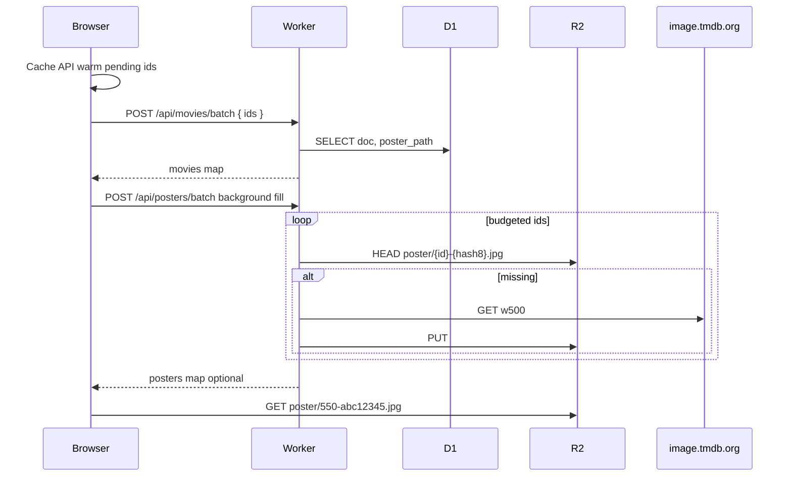

# R2 poster cache plan

Status: proposed.

## Goal

Replace `data/posters/` + `npm run scrape` with **Cloudflare R2** as the shared poster store. Metadata stays on D1 via existing `POST /api/movies/batch`; add `POST /api/posters/batch` for on-demand R2 fill. Splash keeps curated tiles via public R2 URLs on `posters.filmfroggies.com`.

**Separate fix (do before or in parallel):** [hydrateMovies Cache API warm bug](#known-bug-fix-separately-first) — repeat page refreshes re-hit the Worker unnecessarily today.

---

## Architecture



### Client poster URL priority

1. R2 public URL (`buildPosterR2Url(id, posterPath)`)
2. TMDB CDN fallback (`buildImageUrl`)
3. Placeholder

Client builds R2 URL from `posterPath` directly; poster batch is **background fill**, not required to render.

### Poster staleness

R2 key: `poster/{tmdbId}-{hash8}.jpg` where `hash8` = first 8 hex chars of SHA-256 of `poster_path`. When TMDB changes `poster_path`, metadata refresh updates D1 → URL changes → cache bust. Old R2 objects orphaned (acceptable).

### Poster sizes

One **w500** JPEG per movie in R2; browser scales for cards/grid. UI still uses `POSTER_SIZES` conceptually; all resolve to the same R2 object.

---

## Worker: `posters-cache.js`

- `POSTER_BATCH_MAX_IDS = 40`
- `POSTER_FILL_MAX_PER_REQUEST` — cap TMDB fetch + PUT per request (50 subrequest budget)
- `POSTER_BATCH_RATE_LIMITS` — **120 user / 240 IP per 15 min**
- Id-weighted abuse cap: **10,000 ids / user / 15 min**, **20,000 / IP**
- **Global Class A counter** (`r2:class-a:YYYY-MM`): stop PUTs at 900k/month; no 503; omit from map; client TMDB fallback
- Hash keys, D1 `poster_path` lookup, rate limits, wire route in `index.js`
- Tests: `worker/test-posters-cache.js`

Also **raise** [`BATCH_RATE_LIMITS`](../worker/src/movies-cache.js) to 120/240 and add `rateLimitByWeight` in [`rate-limit.js`](../worker/src/rate-limit.js).

---

## Client changes

### `scripts/lib/poster-r2.js`

- `POSTERS_PUBLIC_BASE = "https://posters.filmfroggies.com"`
- `posterPathHash`, `buildPosterR2Url`, batch parse/chunk helpers
- Bundled via `npm run bundle`; tests in `test/poster-r2.test.js`

### `js/app/03-tmdb-client.js`

- Remove `loadLocalPosterData`, `localPosterById`, `localPosterUrlFor`
- **`hydrateMovies`:** Cache API warm → batch only misses → 429 no TMDB cascade
- Background `resolvePosterUrls` for R2 fill
- `posterUrlFor(record, size)` for render

### `js/app/05-render.js`, `js/app/16-splash.js`

- Use `posterUrlFor`; splash uses `buildPosterR2Url` with `posterPath` on `SPLASH_MOVIES` entries

### `scripts/lib/splash.js`

- Add `posterPath` to each `SPLASH_MOVIES` entry (copy from current `data/posters.json`)

### `js/app/08-init.js`

- Remove `await loadLocalPosterData()`

### `netlify.toml`

- Add `https://posters.filmfroggies.com` to CSP `img-src`

---

## Remove scrape layer

- Delete `scripts/scrape-data.js`, `data/posters/`, `data/posters.json`
- Remove `npm run scrape` from `package.json`
- Slim `scripts/lib/local-data.js` (drop poster manifest helpers)
- Update `build.js` `copyData()`, tests, README, cursor rules
- Keep CSV export/import format (`my_list.csv` filename in list-csv) — unrelated to scrape

---

## One-time migration

`scripts/seed-r2-splash-posters.js` — upload splash (+ optionally existing manifest) ids to R2 **before** deleting committed poster files.

---

## Manual setup (Netlify DNS)

| Step | Where |
| --- | --- |
| Create bucket `filmfroggies-posters` | Cloudflare R2 |
| Custom domain `posters.filmfroggies.com` | Cloudflare R2 settings |
| CNAME `posters` → Cloudflare target | Netlify DNS |
| `POSTERS_PUBLIC_BASE`, R2 binding | `wrangler.toml` + deploy |
| Billing alert on R2 usage | Cloudflare notifications |

`netlify.toml` does **not** configure the subdomain — DNS only in Netlify DNS UI.

---

## Deploy checklist

1. Cloudflare: bucket + custom domain + DNS CNAME
2. `node scripts/seed-r2-splash-posters.js`
3. `cd worker && npm test && wrangler deploy`
4. `npm test && npm run bundle && npm run build` → Netlify deploy
5. Smoke: splash (logged out), grid (logged in), cold movie fill

```bash
cd worker && wrangler deploy
```

No `npm run sync-worker-lib` unless synced lib modules change.

---

## Known bug — fix separately first

See [plans/hydrate-cache-api-warm-bug.md](./hydrate-cache-api-warm-bug.md) for a standalone bug report you can fix before the R2 work.

Summary: `hydrateMovies` skips the browser Cache API and re-fetches all ids from the Worker on every page refresh. Combined with 30 req/15min batch limits, power users hit 429. Fix by warming from Cache API before `fetchMoviesBatch`.

---

## Resolved decisions

| Question | Decision |
| --- | --- |
| Public URL | `posters.filmfroggies.com` (custom domain) |
| Poster batch cap | 40 ids accept; partial fill under subrequest budget |
| D1 poster_path | Any row, no stale filter for poster lookup |
| Scrape layer | Remove; R2 replaces it |
| R2 write budget | Global Class A counter; soft degrade, no 503 |
| Abuse limits | 120 req + 10k ids / user / 15 min; Cache API warm for legit refreshes |

---

## Optional later

- R2 backfill script for all D1-cached ids
- Orphan R2 key janitor
- `isPosterUrl` allowlist for R2 host in browser Cache API
