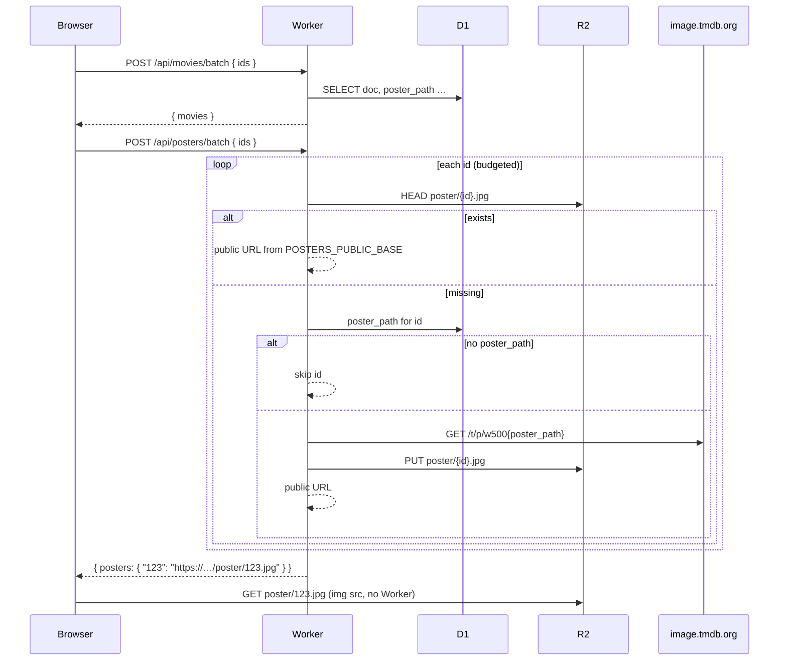

# R2-backed poster caching plan

Status: proposed.

## Goal

Cache TMDB poster **images** in Cloudflare R2 the first time any logged-in user views a movie, so subsequent views (any user) load from a public R2 URL instead of `image.tmdb.org`. Add `POST /api/posters/batch` mirroring the metadata batch pattern. Wire the client to resolve poster URLs after metadata hydration.

**Additive only:** keep `data/posters/` + `data/posters.json` + `npm run scrape` unchanged. Local committed posters remain highest priority in the client.

**Out of scope (unless asked later):** one-off R2 backfill script for all D1-cached movie ids.

---

## Findings from existing code (verified)

### D1 movies table — matches expectations

[`worker/migrations/002_movies.sql`](../worker/migrations/002_movies.sql):

```sql
CREATE TABLE IF NOT EXISTS movies (
  tmdb_id INTEGER PRIMARY KEY,
  doc TEXT NOT NULL,
  poster_path TEXT,
  fetched_at INTEGER NOT NULL,
  refreshed_at INTEGER
);
```

[`worker/src/movies-cache.js`](../worker/src/movies-cache.js) already selects and upserts `poster_path`. [`loadMoviesFromD1`](../worker/src/movies-cache.js) reads full records from `doc` and skips rows older than `STALE_MS` (30 days); it does **not** today expose a poster-path-only lookup. The new poster module needs its own D1 query that reads `tmdb_id, poster_path` without the stale filter (poster paths remain valid even when metadata is stale).

### Worker routing — matches expectations

[`worker/src/index.js`](../worker/src/index.js):

- Auth gate: `requireUser` before protected routes.
- Movies batch wired as:

```js
if (path === "/api/movies/batch") {
  return handleMoviesBatch(request, env, session, ctx, res, ipOf);
}
```

New route follows the same pattern: authenticated POST, dedicated handler module, `makeResponder` JSON helpers, optional `ctx.waitUntil` where safe.

### wrangler.toml — no R2 yet

[`worker/wrangler.toml`](../worker/wrangler.toml) has only `[[d1_databases]]` binding `DB`. No R2 binding, no `filmfroggies-posters` reference anywhere in the repo. Bucket name is free to use.

Worker name is `cinequeue-api`; production site is FilmFroggies (`filmfroggies.com`). Bucket name `filmfroggies-posters` is appropriate and does not collide with existing infra in-repo.

### Metadata hydration order — matches expectations (with nuance)

[`js/app/03-tmdb-client.js`](../js/app/03-tmdb-client.js) `hydrateMovies`:

1. `fetchMoviesBatch` → `POST /api/movies/batch` (D1 hit + TMDB miss fill on Worker)
2. Per-id TMDB fallback via `getMovie` (Cache API + `/api/tmdb` proxy) for remaining ids

**Posters today are not batch-resolved.** At render time [`js/app/05-render.js`](../js/app/05-render.js) `posterHtml`:

```js
const remote = record ? appTmdb.buildImageUrl(record.posterPath, size) : null;
const local = record ? localPosterUrlFor(record, size) : null;
const url = local || remote;
```

Priority: **committed local file** → **TMDB CDN** → placeholder.

Startup loads `data/posters.json` into `localPosterById` ([`loadLocalPosterData`](../js/app/03-tmdb-client.js)). Images load lazily via `attachPosterImage` → `getPosterObjectUrl`, which caches TMDB bytes in the browser Cache API ([`scripts/lib/poster-cache.js`](../scripts/lib/poster-cache.js) — only `https://image.tmdb.org` URLs).

### Build-time poster cache — separate system

[`scripts/scrape-data.js`](../scripts/scrape-data.js) downloads posters for ids in `data/my_list.csv` into `data/posters/`, writes `data/posters.json`. Does not touch D1 or Worker. No conflict with R2 runtime cache if client priority stays **local → R2 → TMDB CDN**.

### Batch caps — differs from task wording

| Constant | Value | Where |
| --- | --- | --- |
| `BATCH_MAX_IDS` | **100** | Accept ids in `/api/movies/batch` body |
| `TMDB_FETCH_MAX_PER_REQUEST` | **40** | Max TMDB API fills per movies batch request |

Task asks poster batch cap at **40 ids** (matching TMDB fill cap, not the 100-id accept cap). Plan uses **40** for posters unless product wants 100 accept + partial fill like movies.

### Worker tests — path differs from task

Tests live as **`worker/test-*.js`** (e.g. [`worker/test-movies-cache.js`](../worker/test-movies-cache.js)), run via `cd worker && npm test`. There is no `worker/test/` directory. New file: `worker/test-posters-cache.js`; register in [`worker/package.json`](../worker/package.json) test script.

### scripts/lib — what belongs where

| Module | Role | Sync to Worker? |
| --- | --- | --- |
| [`poster-cache.js`](../scripts/lib/poster-cache.js) | Browser Cache API; TMDB URL allowlist | App bundle only |
| [`movie-cache.js`](../scripts/lib/movie-cache.js) | Client batch id chunking + response parse | App bundle only |
| [`local-data.js`](../scripts/lib/local-data.js) | Committed poster manifest | App bundle only |
| [`movies-cache.js`](../worker/src/movies-cache.js) | D1 + TMDB metadata batch | Worker-only |

Poster batch handler is **Worker-only** (`worker/src/posters-cache.js`). Client needs thin helpers in **`scripts/lib/poster-batch.js`** (path constant, response parse, chunking) mirrored via `npm run bundle`, same pattern as `movie-cache.js`. Extend `poster-cache.js` only if we want R2 host allowlisting for optional browser caching — not required for v1 (R2 public URLs load directly).

---

## Architecture



### Poster URL priority (client, after this change)

1. Committed local file (`data/posters/` via manifest) — unchanged
2. R2 public URL from `/api/posters/batch`
3. TMDB CDN (`buildImageUrl`) — fallback when batch omits an id
4. Placeholder — no `posterPath` and no URL

Keep `data-poster-fallback` when local + remote both exist; extend fallback chain for R2 failures (R2 → TMDB CDN).

---

## Risks and design constraints

### Subrequest budget (material)

Workers Free: **50 external subrequests/request**. Worst case for 40 ids all missing:

- 40× R2 `head`
- 40× TMDB CDN `fetch`
- 40× R2 `put`

= **120 subrequests** — over limit.

**Mitigation (required in implementation):**

- Track a per-request subrequest budget (reserve ~5 for D1/rate-limit overhead).
- Phase 1: `head` all requested ids (up to 40) — fits when most are hits.
- Phase 2: fill misses only until budget exhausted; set `partial: true` and omit unfilled ids (client keeps TMDB fallback).
- Consider **`POSTER_FILL_MAX_PER_REQUEST = 10`** (or similar) so a cold batch never exceeds ~40 HEAD + 10 fetch + 10 put = 60 — still tight; may need **lower batch cap (20)** or **sequential fill cap of ~5** on free tier. Tune in implementation with comments citing the 50 limit.
- Document that first viewer of many new movies may get TMDB CDN until a later batch fills R2.

### CPU budget (material)

Free tier **10ms CPU/request**. Downloading and writing JPEGs is heavier than JSON metadata. Keep image size fixed at `w500`, stream body to R2, limit concurrent fills (2–4), same concurrency pattern as `TMDB_FETCH_CONCURRENCY`.

### Public R2 access (operational)

Wrangler binding alone does not make objects public. Requires one of:

- R2 public bucket + `r2.dev` subdomain, or
- Custom domain (e.g. `posters.filmfroggies.com`) mapped to bucket

Set **`POSTERS_PUBLIC_BASE`** (Worker var, not secret) to the public origin without trailing slash, e.g. `https://pub-xxxx.r2.dev` or `https://posters.filmfroggies.com`. Object key `poster/550.jpg` → URL `${POSTERS_PUBLIC_BASE}/poster/550.jpg`.

### Image size vs stored key

Task specifies store as `poster/{id}.jpg` from **`w500`** TMDB size regardless of client display size (`w185` card, `w342` detail). Acceptable: one object per movie, simpler keys; cards scale down in browser. Do not encode size in the key unless product asks.

### poster_path validation

Before fetching TMDB CDN, validate `poster_path` with the same rules as [`isValidImagePath`](../scripts/lib/tmdb.js) (leading slash, safe charset). Reject traversal/weird paths.

### Rate limiting

Mirror movies batch: per-user + per-IP limits in D1 via existing [`rateLimit`](../worker/src/rate-limit.js). Suggested starting point: same windows as `BATCH_RATE_LIMITS` in movies-cache, keys prefixed `posters:`.

### Auth

Endpoint requires login (same as `/api/movies/batch`). Public R2 URLs are world-readable once cached — intentional (static CDN behavior).

---

## Implementation plan

### 1. Infrastructure

**[`worker/wrangler.toml`](../worker/wrangler.toml)**

```toml
[[r2_buckets]]
binding = "POSTERS_BUCKET"
bucket_name = "filmfroggies-posters"

[vars]
POSTERS_PUBLIC_BASE = "https://…"  # set per environment; document in README
```

**Manual (Cloudflare dashboard / CLI):**

- Create bucket `filmfroggies-posters`
- Enable public access or attach custom domain
- Set production `POSTERS_PUBLIC_BASE` (and dev/staging if applicable)

**Secrets:** unchanged. TMDB CDN fetch needs no token; `TMDB_READ_TOKEN` stays for metadata only.

### 2. Worker module: `worker/src/posters-cache.js`

Exports (mirror movies-cache surface):

| Export | Purpose |
| --- | --- |
| `POSTER_BATCH_MAX_IDS` | `40` |
| `POSTER_FILL_MAX_PER_REQUEST` | Tunable fill cap (see budget section) |
| `POSTER_BATCH_RATE_LIMITS` | Same shape as movies batch |
| `normalizePosterBatchIds(raw)` | Reuse or import dedupe logic from movies-cache |
| `posterR2Key(id)` | `poster/${id}.jpg` |
| `posterPublicUrl(env, id)` | `${POSTERS_PUBLIC_BASE}/poster/${id}.jpg` |
| `loadPosterPathsFromD1(env, ids)` | `SELECT tmdb_id, poster_path FROM movies WHERE tmdb_id IN (…)` — no stale filter; skip null/empty paths |
| `headPosterInR2(bucket, id)` | `bucket.head(key)` |
| `fetchAndStorePoster(env, id, posterPath)` | Validate path → fetch w500 from TMDB CDN → `bucket.put` with `contentType: image/jpeg` |
| `handlePostersBatch(request, env, session, ctx, res, clientIp)` | Full handler |

**Handler flow:**

1. POST only; require `POSTERS_BUCKET` + `POSTERS_PUBLIC_BASE`
2. Rate limit (IP + user)
3. Parse `{ ids }`; normalize; 400 if empty
4. Parallel `head` for all ids (Promise.all with chunking if needed)
5. For hits: add to response map
6. For misses: load `poster_path` from D1 (single IN query)
7. Fill misses up to `POSTER_FILL_MAX_PER_REQUEST` with concurrency limit
8. Return `{ posters: { "550": "https://…" }, partial?: true }`
9. Do **not** call TMDB REST API for metadata — D1 only

**TMDB CDN URL:** `https://image.tmdb.org/t/p/w500${poster_path}` (path already includes leading slash).

Wire in [`worker/src/index.js`](../worker/src/index.js):

```js
if (path === "/api/posters/batch") {
  return handlePostersBatch(request, env, session, ctx, res, ipOf);
}
```

### 3. Client: `scripts/lib/poster-batch.js`

- `POSTERS_BATCH_PATH = "/posters/batch"`
- `POSTER_BATCH_MAX_IDS = 40`
- `chunkPosterIds(ids)` — chunk at 40
- `parsePosterBatchResponse(body)` → `{ posters: Map<number, string>, partial: boolean }`

Add to [`scripts/app-sync-config.js`](../scripts/app-sync-config.js); run `npm run bundle`.

Add `POSTERS_BATCH_PATH` to [`scripts/lib/account-sync.js`](../scripts/lib/account-sync.js) exports (optional alias from poster-batch to keep paths centralized).

### 4. Client: [`js/app/03-tmdb-client.js`](../js/app/03-tmdb-client.js)

**State:** session map `r2PosterUrlById = new Map()` (or plain object keyed by id).

**New functions:**

- `fetchPostersBatch(ids)` — POST with bearer token, same base/chunking as movies batch
- `resolvePosterUrls(ids)` — populate map; ignore failures silently

**Integration point:** after successful metadata hydration in `hydrateMovies` (and optionally after per-id fallback completes), call `resolvePosterUrls` for ids that have records with `posterPath` and no local committed poster.

**New helper:** `posterUrlFor(record, size)`:

```js
function posterUrlFor(record, size) {
  if (!record) return null;
  const local = localPosterUrlFor(record, size);
  if (local) return local;
  const cached = r2PosterUrlById.get(record.id);
  if (cached) return cached;
  return appTmdb.buildImageUrl(record.posterPath, size);
}
```

Export for `05-render.js` (or move render to call a single resolver).

### 5. Client: [`js/app/05-render.js`](../js/app/05-render.js)

Replace direct `buildImageUrl` / `localPosterUrlFor` composition in `posterHtml` and `detailPosterFrameHtml` with `posterUrlFor`.

Fallback attribute: when R2 URL is primary, set `data-poster-fallback` to TMDB CDN URL (same pattern as local+remote today) so `handleImageError` can retry TMDB.

Clear `r2PosterUrlById` in `clearMovieCache` if posters should refresh on cache clear.

### 6. Browser Cache API behavior

R2 URLs are not `image.tmdb.org`; [`isPosterUrl`](../scripts/lib/poster-cache.js) returns false → `attachPosterImage` sets `img.src` directly (no blob Cache API). Correct for v1: R2 edge serves bytes; no double-cache needed.

Optional later: extend `isPosterUrl` to allowlist `POSTERS_PUBLIC_BASE` host for offline Cache API — not in v1.

### 7. Tests: `worker/test-posters-cache.js`

Follow [`worker/test-movies-cache.js`](../worker/test-movies-cache.js) patterns: mock R2 bucket (`head`, `put`), mock D1, stub `fetch` for TMDB CDN.

| Test | Assert |
| --- | --- |
| Cache hit | `head` returns object → public URL in map, no `fetch`, no `put` |
| Cache miss | no `head` hit → D1 `poster_path` → CDN fetch → `put` → public URL |
| Batch cap | 41 ids → truncated/rejected per normalize rules |
| Missing `poster_path` | id omitted from response, 200 otherwise |
| Empty ids | 400 |
| Subrequest budget | many misses → `partial: true`, fill cap respected (unit-test budget helper if extracted) |

Register in [`worker/package.json`](../worker/package.json) test script.

**Root `npm test`:** unchanged unless we add client tests in `test/poster-batch.test.js` for parse/chunk helpers — recommended for `scripts/lib/poster-batch.js`.

### 8. Documentation

Update [`README.md`](../README.md):

- R2 bucket setup, public access, `POSTERS_PUBLIC_BASE`
- Deploy steps: create bucket → set var → `wrangler deploy`
- Clarify relationship to `npm run scrape` committed posters

---

## Deploy checklist

1. Create R2 bucket `filmfroggies-posters` and public URL
2. Set `POSTERS_PUBLIC_BASE` in wrangler.toml `[vars]` or dashboard
3. `cd worker && npm test`
4. `cd worker && wrangler deploy`
5. `npm run bundle` + static deploy if client changed
6. Smoke test: open a movie not in `data/posters.json`, confirm Network shows R2 URL on second load

**No** `npm run sync-worker-lib` unless shared lib changes affect Worker-synced modules (this feature should not).

---

## Optional follow-up (do not build unless asked)

**Backfill script** (`scripts/backfill-r2-posters.js` or wrangler-admin one-off):

- Query all `tmdb_id, poster_path` from D1 `movies` where `poster_path IS NOT NULL`
- For each id, skip if R2 `head` hits
- Else fetch w500 + put
- Rate-limit / batch to avoid TMDB abuse; run locally or as authenticated admin Worker route

---

## Open questions for product (resolve before or during implementation)

1. **Batch accept cap:** strict 40 ids max in body, or 100 accept with fill cap like movies batch?
2. **Public URL:** `r2.dev` subdomain vs custom domain `posters.filmfroggies.com`?
3. **Stale D1 rows:** read `poster_path` from any row regardless of `fetched_at`, or only fresh metadata rows?
4. **Discover/search previews:** batch poster resolve for search results too, or only collection hydration paths?

Default recommendations: **40 accept cap**, **custom domain if available**, **any D1 row with poster_path**, **hydrateMovies path only for v1** (search still uses TMDB CDN until those movies enter collection).
