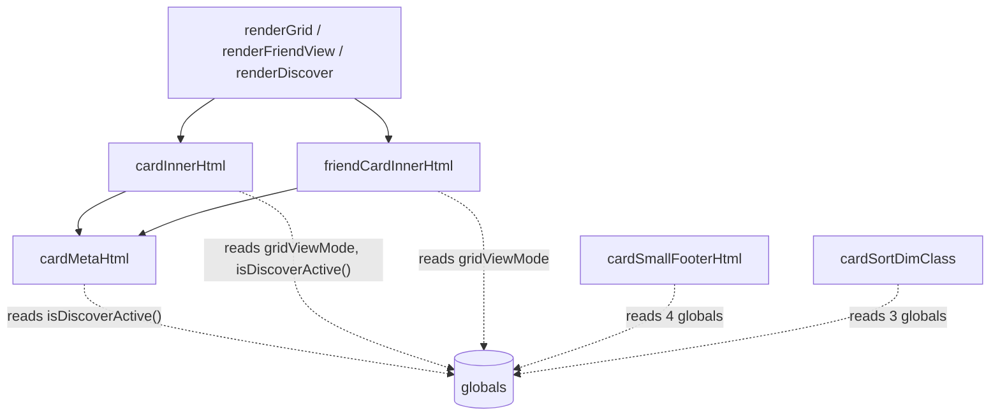
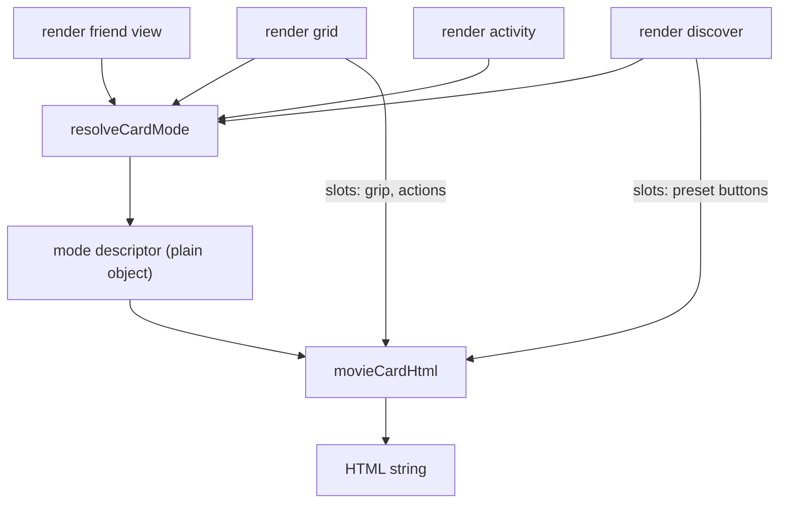

# Shared card component plan

Status: proposed.

## Goal

Replace five forked card renderers with **one component plus one mode resolver**, so per-surface differences are expressed as parameters instead of duplicated functions that drift.

The differences between surfaces are legitimate product variation and all of them are preserved. What changes is *where* the variation lives: today each leaf renderer discovers its own context by reading globals, which means a new surface cannot reuse existing composition and must fork it. After this change, context is passed in.

**Out of scope:** No framework, no bundler, no new dependencies. No visual change — this refactor is markup-preserving by design. CSS class names stay exactly as they are.

## Current state

Every leaf renderer resolves context by probing ambient globals:



### The five surfaces

| Surface | Entry point | Notes |
| --- | --- | --- |
| Grid (owned) | [`rowHtml:684`](../js/app/05-render.js) → `rowInnerHtml:670` → `cardInnerHtml:628` / `cardPosterOnlyHtml:429` | Skeletons via `skeletonRowHtml:461` |
| Friend view | [`friendMovieRowHtml:193`](../js/app/13-friend-view.js) → `friendRowInnerHtml:179` → `friendCardInnerHtml:148` | Full fork of the grid path |
| Discover | `if (isDiscoverActive())` branch inside `cardInnerHtml:651` + `discoverCardTextHtml:212` | Wedged into the owned path |
| Friend activity | Inline template in `renderFriendActivity()` ([`17-friend-activity.js:192`](../js/app/17-friend-activity.js)) | Own markup vocabulary |
| Splash | [`splashTileHtml:176`](../scripts/lib/splash.js) + `splashMetaRowHtml:156` | In `scripts/lib/`, so it hand-rebuilds `card-meta-row` / `rating-segment` |

### Ambient context probes

These are the reason forking is currently the only option. A leaf cannot serve a surface it does not already name:

| Function | Globals read |
| --- | --- |
| `posterPlaceholderHtml:61` | `isDiscoverActive()` |
| `cardMetaHtml:114` | `isDiscoverActive()` |
| `cardFanRatingSegmentHtml:159` | `usesWatchedStyleDisplay()`, `isDiscoverActive()` |
| `cardUserRatingSegmentHtml:323` | `isDiscoverActive()` |
| `cardDetailRatingsHtml:227` | `gridViewMode`, `isDiscoverActive()`, `usesWatchedStyleDisplay()` |
| `cardChronologicalRatingOverlayHtml:31` | `isWatchedListActive()`, `isFriendViewActive()`, `isWatchedSortMode()` |
| `cardSmallFooterHtml:390` | `isDiscoverActive()`, `gridViewMode`, `isWatchlistActive()`, `usesWatchedStyleDisplay()` |
| `cardSortDimClass:410` | `isDiscoverActive()`, `usesWatchedStyleDisplay()`, `usesCustomDisplayOrder()` |
| `cardInnerHtml:628` | `gridViewMode`, `isDiscoverActive()` |
| `listShowsReorderGrip:468` | `isDiscoverActive()`, `reorderModeActive`, `usesCustomDisplayOrder()` |
| `discoverCardActionsHtml:187` | `discoverTab` |

### Resulting duplicate pairs

| Owned ([`05-render.js`](../js/app/05-render.js)) | Friend ([`13-friend-view.js`](../js/app/13-friend-view.js)) | Actual difference |
| --- | --- | --- |
| `cardReleaseYearFooterHtml:353` | `friendReleaseYearFooterHtml:108` | `?? localMovieRecord(movieId)` |
| `cardSmallWatchedFooterContentHtml:371` | `friendSortFooterContentHtml:116` | Different sort-field subset |
| `cardSmallFooterHtml:390` | `friendCardFooterHtml:134` | Adds `card-footer--friend` |
| `cardInnerHtml:628` | `friendCardInnerHtml:148` | Trailing chit, poster size |
| `rowInnerHtml:670` | `friendRowInnerHtml:179` | Adds `card--friend`, `is-seen-by-you` |

Each pair is a small legitimate difference wrapped in a large identical body. That ratio is the defect.

### What is already healthy

The primitive layer is fine and both paths already share it: `posterWrapOpen:48`, `closePosterWrap:44`, `posterHtml:73`, `posterPlaceholderHtml:61`, `cardMetaHtml:114`, `ratingSegmentHtml:132`, `ratingChitHtml:144`. The CSS vocabulary (`card-body`, `card-text`, `card-title`, `card-meta-row`) is consistent. **Only composition forked.** This plan does not touch primitives.

Also note [`getActiveDisplayContext():372`](../js/app/01-config-dom-state.js) already returns a context descriptor — it carries list identity but no presentation. It is the seed of the right pattern.

## Target architecture



Two new pure CommonJS modules in `scripts/lib/`, mirrored to `js/app/00-*.js` by `npm run bundle`. Neither reads a global or touches the DOM.

## 1. `scripts/lib/card-mode.js`

Pure resolver. Takes raw state facts, returns a flat descriptor.

```js
resolveCardMode({
  surface,        // "grid" | "friend" | "discover" | "activity" | "splash"
  viewMode,       // "cards" | "detail"
  listKind,       // "preset" | "custom"
  listId,         // WATCHED_ID | WATCHLIST_ID | custom id
  sortField,      // "custom" | "title" | "added" | "year" | "watched" | "user-rating" | "fan-rating" | "friend-rating"
  customOrder,    // boolean
  reorderActive,  // boolean
  discoverTab,    // "now-playing" | "upcoming" | null
  seenByYou,      // boolean — friend surface only
})
```

Returns:

| Field | Type | Meaning |
| --- | --- | --- |
| `posterSize` | `"w92" \| "w185" \| "w342"` | From `appTmdb.POSTER_SIZES` |
| `showTitle` | boolean | Title block in card body |
| `metaKind` | `"year-runtime" \| "release-date" \| null` | Which `cardMetaHtml` branch |
| `trailing` | `{ segments: ("fan"\|"mine"\|"them")[] } \| null` | Rating chit beside meta |
| `footer` | `{ variant: "sort" \| "rating", content }` \| null | Small-card footer |
| `overlay` | `"chronological-rating" \| null` | Poster overlay |
| `grip` | boolean | Drag handle |
| `dim` | `"unrated" \| "no-watch-date" \| null` | Sort de-emphasis class |
| `classes` | string[] | e.g. `["card--friend", "is-seen-by-you"]` |
| `slots` | string[] | Names of slots the caller must supply |

**Why this is the consistency lock:** `surface × viewMode × sortField` is a finite matrix, so the resolver is exhaustively testable. Adding a sixth surface is one branch in one tested function.

### Per-surface descriptor matrix

To be filled in and verified against current output during step 2. Initial reading of the code:

| Surface / mode | posterSize | showTitle | metaKind | trailing | footer | overlay |
| --- | --- | --- | --- | --- | --- | --- |
| grid / cards | `card` | no | — | — | sort (watched-style only) | chronological |
| grid / detail | `detailGrid` | yes | year-runtime | fan+mine | — | chronological |
| friend / cards | `card` | no | — | — | rating or sort | — |
| friend / detail | `detailGrid` | yes | year-runtime | them+mine(+fan) | — | — |
| discover / cards | `card` | on poster | — | — | — | — |
| discover / detail | `detailGrid` | yes | release-date | fan (now-playing only) | — | — |
| activity | `card` | mobile: no | — | rating (overlay) | — | — |
| splash | n/a (direct URL) | yes | year | mine (rated variant) | — | — |

## 2. `scripts/lib/movie-card.js`

`movieCardHtml(movie, mode, slots)` — pure string builder.

- Derives skeleton / error / loaded purely from whether `movie` is present, replacing the duplicated `stateClass` ternary in `rowInnerHtml:670` and `friendRowInnerHtml:179`
- Emits today's markup byte-for-byte for existing surfaces
- Accepts pre-rendered strings for `slots` (grip, discover actions, activity friend link) so the lib stays DOM-free and event-free

**Record lookups stay in the app layer.** The lib receives an already-resolved record. If it needed `movieById` or `localMovieRecord` it would need globals again and the refactor gains nothing.

## 3. Adapter changes in `js/app/`

Each view keeps its own `render*()`, which gathers state, calls the resolver, calls the component:

- [`05-render.js`](../js/app/05-render.js) — `rowInnerHtml`, `cardInnerHtml`, `cardPosterOnlyHtml`, `skeletonCardInnerHtml`, `cardSmallFooterHtml`, `cardSortDimClass` become thin callers; the discover branch at `:651` moves into the resolver
- [`13-friend-view.js`](../js/app/13-friend-view.js) — delete `friendRowInnerHtml`, `friendCardInnerHtml`, `friendCardFooterHtml`, `friendSortFooterContentHtml`, `friendReleaseYearFooterHtml`; keep `friendMovieHighlightSeen` as a resolver input
- [`11-discover.js`](../js/app/11-discover.js) — pass `discoverTab`; `discoverCardActionsHtml` becomes a slot
- [`17-friend-activity.js`](../js/app/17-friend-activity.js) — activity item becomes `movieCardHtml` with `surface: "activity"`
- [`scripts/lib/splash.js`](../scripts/lib/splash.js) — optional; last or never

## 4. Registration (easy to forget)

- Add both modules to [`scripts/app-sync-config.js`](../scripts/app-sync-config.js) with their export lists → generates `js/app/00-app-card-mode.js`, `js/app/00-app-movie-card.js`
- Add both generated files to the `PARTS` array in [`scripts/bundle-app-js.js`](../scripts/bundle-app-js.js), in `00-*` load-order position
- Run `npm run bundle` after every edit under `scripts/lib/` or `js/app/`
- **No `worker/` mirror.** Card rendering is browser-only; do not add to [`scripts/sync-worker-lib.js`](../scripts/sync-worker-lib.js)
- `test/app-sync-exports.test.js` will fail until the export lists match — that is the intended guard

## 5. Tests

New `test/card-mode.test.js`:

- One case per `surface × viewMode`, asserting the full descriptor
- Sort-field sweep for grid and friend footers (`custom`, `title`, `added`, `year`, `watched`, `user-rating`, `fan-rating`, `friend-rating`)
- Friend `seenByYou` adds `is-seen-by-you`; discover suppresses ratings and grip; watchlist suppresses footer

New `test/movie-card.test.js`:

- Loaded / skeleton / error for each surface
- Slots interpolate in the right position
- Poster size selection per mode
- Escaping: a title containing `<script>` and quotes stays escaped

**Run:** `npm test` (root, covers `test/*.test.js`). Worker tests are unaffected.

## 6. Rollout

Ordered so the site works throughout and each step ships alone:

| Step | Change | Risk |
| --- | --- | --- |
| 1 | `card-mode.js` + tests, nothing calls it | none |
| 2 | `movie-card.js` + tests, output matched to current markup | none (unused) |
| 3 | Cut over **friend activity** | low — smallest surface |
| 4 | Cut over **friend view** | medium — deletes the 5 forks, biggest win |
| 5 | Cut over **grid + discover** | highest — do last, component proven by then |
| 6 | **Splash** | optional; already tested and isolated |

Steps 1–2 are pure gain even if the effort stops there: they produce a tested specification of what a card is, which currently exists nowhere except splash.

**Verification per cutover:** diff rendered HTML before/after for a fixed list of movie ids across both view modes and every sort field. Visual check on mobile and desktop, since 9k lines of CSS key off this markup.

## Deliberately not doing

- **Migrating to React.** Considered and rejected. It would force a component boundary, which is a real benefit, but the cost here is ~18k lines of `js/app/` sharing one IIFE scope with implicit globals (`movieById`, `userState`, `gridViewMode`, `movieErrors`, `detailMovieId`, `friendViewSections`), plus a bundler, plus 9k lines of global CSS keyed to exact markup. The long half-migrated period would make inconsistency *worse*, and none of that work addresses the ambient-context defect that actually causes the drift. Consolidation is a prerequisite for that migration anyway, so this plan is the correct first step either way.
- **Folding interactive state into the descriptor.** Discover preset buttons carry event wiring and live membership; activity carries friend identity and watch date. These stay slots. Making them mode flags would rebuild the same `if` tree in a new location.
- **Unifying the detail overlay.** Different component with its own mode table (see `product-ui-state.mdc`). Out of scope.
- **Changing any CSS.** Markup-preserving refactor. Class consolidation, if wanted, is a separate follow-up once one component owns the markup.
- **Rewriting `cardMetaHtml` / `posterHtml` / rating chits.** The primitive layer is healthy and already shared.

## Risk / tradeoffs

| Item | Notes |
| --- | --- |
| Step 2 output matching | The hard part. Current markup is untested, so "matches today" must be established by hand once per surface. Budget for it. |
| Descriptor size | ~12–15 fields. Not elegant, but an honest measure of real product variation; the win is that it is enumerable and tested in one place. |
| CSS regressions | Markup churn breaks styles silently. Mitigated by byte-for-byte matching and per-step visual checks. |
| Grid hydration path | `applyHydratedRecord()` patches single rows; it must keep working against component output. Verify in step 5. |
| Partial adoption | If it stalls after step 3 the codebase has both patterns. Acceptable — the fork count still drops and nothing regresses. |

## File touch list

| File | Change |
| --- | --- |
| `scripts/lib/card-mode.js` | New — resolver |
| `scripts/lib/movie-card.js` | New — component |
| `test/card-mode.test.js` | New |
| `test/movie-card.test.js` | New |
| `scripts/app-sync-config.js` | Register both modules + export lists |
| `scripts/bundle-app-js.js` | Add both generated parts to `PARTS` |
| `js/app/00-app-card-mode.js` | **Generated** — `npm run bundle` |
| `js/app/00-app-movie-card.js` | **Generated** — `npm run bundle` |
| `js/app/05-render.js` | Thin adapters; discover branch moves to resolver |
| `js/app/13-friend-view.js` | Delete 5 forked functions; keep `friendMovieHighlightSeen` |
| `js/app/11-discover.js` | Pass `discoverTab`; actions become a slot |
| `js/app/17-friend-activity.js` | Activity item via `movieCardHtml` |
| `scripts/lib/splash.js` | Optional (step 6) |
| `README.md` | Note the card component in the layout section |
